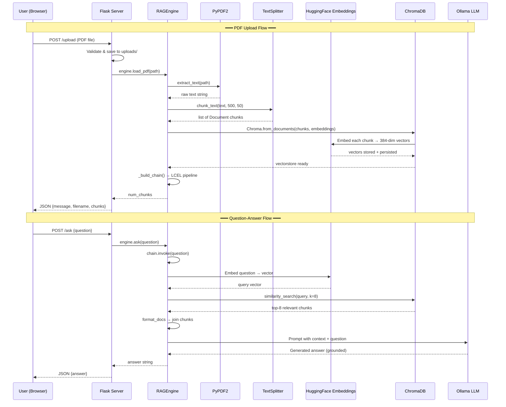

# Chat with PDF — Architecture Overview & System Design

## 1. Project Summary

**Chat with PDF** is a full-stack **Retrieval-Augmented Generation (RAG)** web application that lets users upload PDF documents and ask natural-language questions about their content. The system extracts text, chunks and embeds it into a vector store, then retrieves the most relevant passages at query time and feeds them to a local LLM to generate grounded, hallucination-free answers.

| Layer | Technology | Purpose |
|-------|-----------|---------|
| Web Framework | Flask | HTTP server, routing, file uploads |
| PDF Parsing | PyPDF2 | Text extraction from PDF pages |
| Text Splitting | LangChain `RecursiveCharacterTextSplitter` | Chunk documents for embedding |
| Embeddings | HuggingFace `all-MiniLM-L6-v2` | Convert text → 384-dim vectors |
| Vector Store | ChromaDB (persistent) | Similarity search over embeddings |
| LLM | Ollama (`llama3.2`) via `ChatOllama` | Answer generation from context |
| Chain Orchestration | LangChain 1.x LCEL (Runnables) | Compose retriever → prompt → LLM pipeline |
| Frontend | HTML + Vanilla JS + CSS | Chat interface with drag-and-drop upload |

---

## 2. High-Level Architecture

```
┌─────────────────────────────────────────────────────────────────┐
│                        BROWSER (Client)                        │
│  ┌──────────────┐   ┌───────────────────────────────────────┐  │
│  │   Sidebar     │   │           Chat Area                   │  │
│  │  - PDF Upload │   │  - Message Bubbles (User / AI)       │  │
│  │  - File Info  │   │  - Typing Indicator                  │  │
│  │  - Status     │   │  - Question Input Bar                │  │
│  └──────┬───────┘   └──────────────────┬────────────────────┘  │
│         │  POST /upload                │  POST /ask             │
└─────────┼──────────────────────────────┼────────────────────────┘
          │                              │
          ▼                              ▼
┌─────────────────────────────────────────────────────────────────┐
│                     FLASK SERVER  (app.py)                      │
│                                                                 │
│  /upload  →  save file  →  engine.load_pdf(path)               │
│  /ask     →  validate   →  engine.ask(question)                │
│  /        →  render index.html                                  │
└──────────────────────────┬──────────────────────────────────────┘
                           │
                           ▼
┌─────────────────────────────────────────────────────────────────┐
│                   RAG ENGINE  (rag_engine.py)                   │
│                                                                 │
│  ┌────────────┐  ┌──────────┐  ┌────────────┐  ┌────────────┐ │
│  │ PDF Extract│→ │ Chunking │→ │ Embedding  │→ │ ChromaDB   │ │
│  │  (PyPDF2)  │  │(500/50)  │  │(MiniLM-L6) │  │(Persist)   │ │
│  └────────────┘  └──────────┘  └────────────┘  └─────┬──────┘ │
│                                                       │        │
│  Question ──→ Retriever (k=8) ──→ Prompt ──→ LLM ──→ Answer   │
│               (similarity)        (strict)   (Ollama)          │
└─────────────────────────────────────────────────────────────────┘
```

---

## 3. System Flow Diagram (Mermaid)



---

## 4. Directory Structure

```
chat_with_pdf/
├── app.py                 # Flask application — routes & server setup
├── rag_engine.py          # RAGEngine class — full RAG pipeline
├── requirements.txt       # Python dependencies
├── templates/
│   └── index.html         # Chat UI (HTML + inline JS)
├── static/
│   └── style.css          # Premium dark theme styles
├── uploads/               # Stored uploaded PDFs
├── chroma_db/             # ChromaDB persistent vector store
└── myenv/                 # Python virtual environment
```

---

## 5. Design Decisions & Trade-offs

### Why Flask (not FastAPI/Django)?
- **Simplicity**: Flask's minimalism keeps the project approachable for academic contexts.
- **Synchronous**: The Ollama LLM call is blocking — Flask handles this naturally without async complexity.

### Why ChromaDB (not FAISS/Pinecone)?
- **Persistence**: ChromaDB writes to disk, surviving server restarts.
- **LangChain Integration**: First-class `Chroma` wrapper in `langchain_community`.
- **Zero Infrastructure**: No external server needed — runs in-process.

### Why `all-MiniLM-L6-v2` (not OpenAI embeddings)?
- **Free & Local**: No API key, no cost, no data leaving the machine.
- **Performance**: 384-dim vectors are fast for similarity search on small/medium corpora.

### Why Ollama (not OpenAI API)?
- **Privacy**: All inference runs locally — no data sent to external servers.
- **Cost**: Completely free — no per-token charges.

### Why `temperature=0` for the LLM?
- Deterministic outputs — the same question against the same context yields the same answer. Critical for a document QA system where faithfulness to the source text trumps creativity.

### Why `k=8` retrieved chunks?
- Balances recall (finding the right passage) vs. context window usage. With 500-char chunks, 8 chunks ≈ 4,000 chars of context — well within Llama 3.2's context window.

### Why `chunk_size=500, chunk_overlap=50`?
- **500 chars**: Small enough for precise retrieval, large enough to contain a meaningful paragraph.
- **50 chars overlap**: Prevents information loss at chunk boundaries — sentences split across chunks are partially duplicated.

### Why rebuild ChromaDB on each upload (shutil.rmtree)?
- Current design is **single-PDF** per session. Rebuilding ensures a clean index without stale data from previously uploaded documents.
