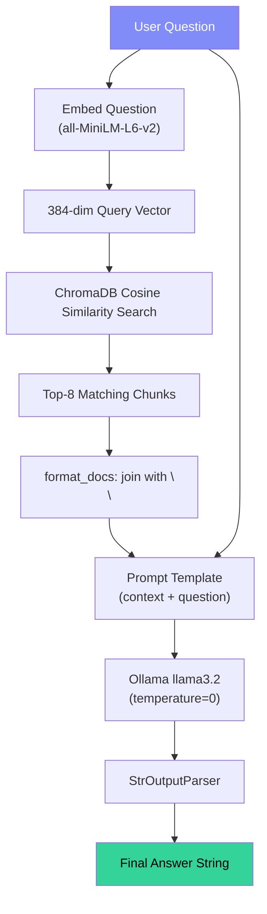

# Chat with PDF — `rag_engine.py` Deep Dive (RAG Pipeline)

## File Purpose

`rag_engine.py` contains the `RAGEngine` class — the **brain** of the application. It encapsulates the entire RAG pipeline: PDF text extraction → chunking → embedding → vector storage → retrieval → LLM generation.

---

## Imports & Dependencies

```python
import os                                                    # Line 5
import shutil                                                # Line 6
from PyPDF2 import PdfReader                                 # Line 7

from langchain_text_splitters import RecursiveCharacterTextSplitter  # Line 9
from langchain_community.embeddings import HuggingFaceEmbeddings     # Line 10
from langchain_community.vectorstores import Chroma                  # Line 11
from langchain_ollama import ChatOllama                              # Line 12
from langchain_core.prompts import ChatPromptTemplate                # Line 13
from langchain_core.runnables import RunnablePassthrough              # Line 14
from langchain_core.output_parsers import StrOutputParser            # Line 15
```

| Import | Package | Role |
|--------|---------|------|
| `PdfReader` | `PyPDF2` | Read and extract text from each PDF page |
| `RecursiveCharacterTextSplitter` | `langchain_text_splitters` | Split text into overlapping chunks using smart separators (`\n\n`, `\n`, `. `, ` `) |
| `HuggingFaceEmbeddings` | `langchain_community` | Wraps sentence-transformers to produce 384-dim embeddings |
| `Chroma` | `langchain_community` | LangChain wrapper for ChromaDB vector store |
| `ChatOllama` | `langchain_ollama` | LangChain wrapper for locally-running Ollama models |
| `ChatPromptTemplate` | `langchain_core` | Structured prompt template with variables |
| `RunnablePassthrough` | `langchain_core` | Passes input through unchanged in LCEL chains |
| `StrOutputParser` | `langchain_core` | Extracts plain string from LLM `AIMessage` output |

---

## Line-by-Line Code Explanation

### Constants (Line 18)

```python
CHROMA_DIR = os.path.join(os.path.dirname(__file__), "chroma_db")
```
Persistent directory for ChromaDB. Stored alongside the source files.

---

### `__init__` (Lines 23–35) — Initialization

```python
class RAGEngine:
    def __init__(self, model_name: str = "llama3.2"):
        self.embeddings = HuggingFaceEmbeddings(
            model_name="all-MiniLM-L6-v2"
        )
        self.llm = ChatOllama(
            model=model_name,
            temperature=0
        )
        self.vectorstore = None
        self.chain = None
```

**What happens at construction:**
1. **Embeddings** — Downloads and loads the `all-MiniLM-L6-v2` model (~80MB, cached after first run). This model maps text → 384-dimensional vectors using mean pooling over BERT token embeddings.
2. **LLM** — Creates a `ChatOllama` client pointing at the local Ollama server (`http://localhost:11434`). `temperature=0` makes outputs deterministic.
3. **State** — `vectorstore` and `chain` start as `None` until a PDF is loaded.

---

### `extract_text()` (Lines 40–50) — PDF Text Extraction

```python
@staticmethod
def extract_text(pdf_path: str) -> str:
    reader = PdfReader(pdf_path)
    pages = []
    for page in reader.pages:
        content = page.extract_text()
        if content:
            pages.append(content)
    return "\n".join(pages)
```

**How it works:**
1. Opens the PDF and iterates over every page.
2. Calls `page.extract_text()` — PyPDF2 extracts text by parsing the PDF content stream, handling fonts, encodings, and layout.
3. Skips pages with no extractable text (e.g., scanned images without OCR).
4. Joins all page texts with newlines into a single string.

> **Limitation**: Scanned PDFs or image-only PDFs will produce empty text. OCR (e.g., Tesseract) would be needed.

---

### `chunk_text()` (Lines 55–61) — Text Chunking

```python
@staticmethod
def chunk_text(text: str, chunk_size=500, chunk_overlap=50):
    splitter = RecursiveCharacterTextSplitter(
        chunk_size=chunk_size,
        chunk_overlap=chunk_overlap
    )
    return splitter.create_documents([text])
```

**How `RecursiveCharacterTextSplitter` works internally:**

```
Input text (e.g., 5000 chars)
    │
    ▼
Try splitting by "\n\n" (paragraph breaks)
    │ If chunks > 500 chars...
    ▼
Try splitting by "\n" (line breaks)
    │ If chunks > 500 chars...
    ▼
Try splitting by ". " (sentence breaks)
    │ If chunks > 500 chars...
    ▼
Try splitting by " " (word breaks)
    │ If chunks > 500 chars...
    ▼
Split by individual character
```

- Each chunk is ≤ 500 characters.
- Adjacent chunks share 50 characters of overlap to preserve context at boundaries.
- Returns a list of `Document` objects (each has `.page_content` and `.metadata`).

---

### `build_vectorstore()` (Lines 66–75) — Vector Store Construction

```python
def build_vectorstore(self, documents):
    if os.path.exists(CHROMA_DIR):
        shutil.rmtree(CHROMA_DIR)                    # Delete old store

    self.vectorstore = Chroma.from_documents(
        documents=documents,
        embedding=self.embeddings,
        persist_directory=CHROMA_DIR,
    )
```

**Step-by-step:**
1. **Clean slate** — Removes the existing ChromaDB directory entirely. This ensures no stale vectors from a previous PDF contaminate results.
2. **Embed & store** — `Chroma.from_documents()` does three things internally:
   - Calls `self.embeddings.embed_documents()` on all chunk texts.
   - Creates a ChromaDB collection and inserts vectors + metadata.
   - Persists the SQLite + parquet files to `chroma_db/`.

---

### `_build_chain()` (Lines 80–114) — LCEL RAG Chain

This is the **core of the RAG pipeline** using LangChain Expression Language (LCEL):

```python
def _build_chain(self):
    retriever = self.vectorstore.as_retriever(search_kwargs={"k": 8})
```
Creates a retriever that performs **cosine similarity search** returning the top 8 most relevant chunks.

```python
    prompt = ChatPromptTemplate.from_template(
    """You must answer ONLY using the provided context.
    ...
    Context:
    {context}

    Question:
    {question}

    Answer:"""
    )
```

**Prompt Design — Why these strict rules?**
- Rule 1–2: Prevents hallucination — the LLM must only use provided text.
- Rule 3: Provides a safe fallback for unanswerable questions.
- Rule 4: Enforces faithfulness to source material.

This prompt pattern is called **"closed-book with context"** — the model behaves as if it has no world knowledge, only the context.

```python
    def format_docs(docs):
        return "\n\n".join(doc.page_content for doc in docs)
```
Converts the list of `Document` objects into a single formatted string with double-newline separators.

```python
    self.chain = (
        {
            "context": retriever | format_docs,
            "question": RunnablePassthrough(),
        }
        | prompt
        | self.llm
        | StrOutputParser()
    )
```

**LCEL Pipeline Breakdown:**

```
Input: "What is machine learning?"
         │
         ├──→ "context" branch: retriever | format_docs
         │     │
         │     ├── retriever: embed the question, search ChromaDB, get top-8 docs
         │     └── format_docs: join doc texts into one string
         │
         └──→ "question" branch: RunnablePassthrough()
               │
               └── passes "What is machine learning?" through unchanged
         │
         ▼
    prompt: fills {context} and {question} into the template
         │
         ▼
    self.llm: sends the formatted prompt to Ollama (llama3.2)
         │
         ▼
    StrOutputParser(): extracts the text content from AIMessage
         │
         ▼
    Output: "Machine learning is a subset of..."
```

---

### Public API: `load_pdf()` (Lines 119–130)

```python
def load_pdf(self, pdf_path: str):
    text = self.extract_text(pdf_path)
    if not text.strip():
        return 0
    docs = self.chunk_text(text)
    self.build_vectorstore(docs)
    self._build_chain()
    return len(docs)
```

**Orchestration sequence:**
1. Extract → 2. Chunk → 3. Embed & Store → 4. Build Chain.
Returns 0 if the PDF has no extractable text (empty/scanned PDF).

### Public API: `ask()` (Lines 132–137)

```python
def ask(self, question: str):
    if self.chain is None:
        return "Please upload a PDF first."
    return self.chain.invoke(question)
```

Guard check prevents errors if no PDF has been loaded yet. `chain.invoke()` triggers the full LCEL pipeline.

---

## RAG Pipeline — Complete Internal Flow


